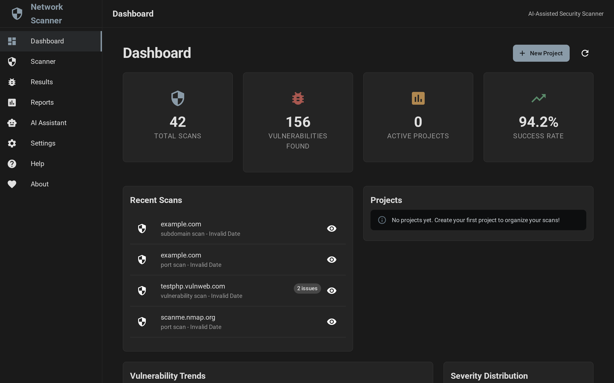
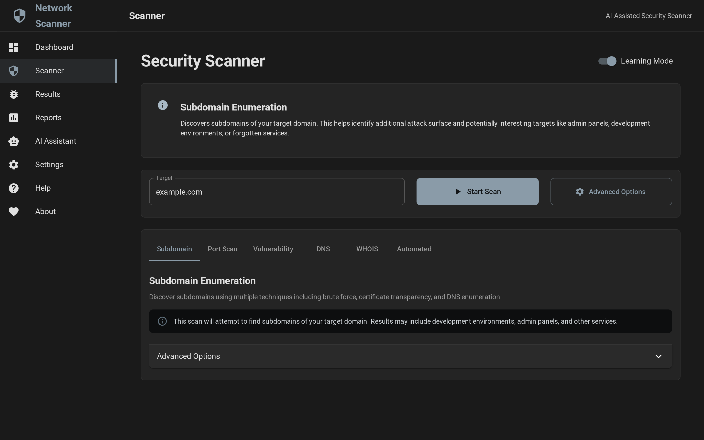
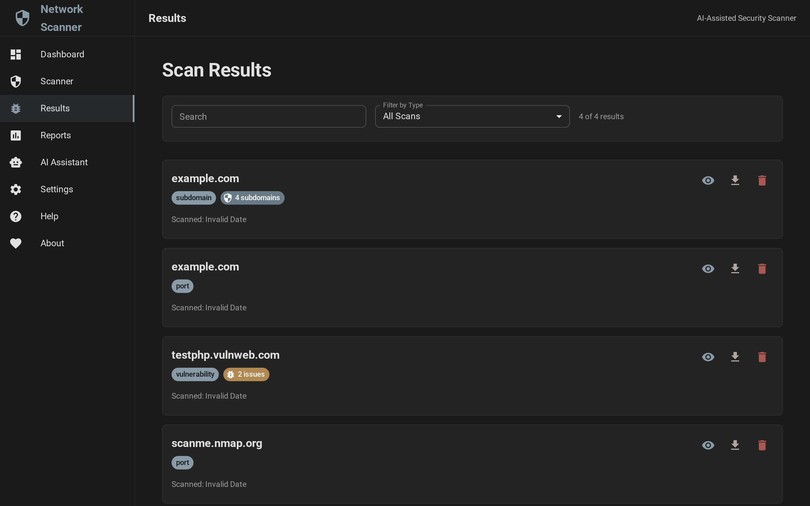
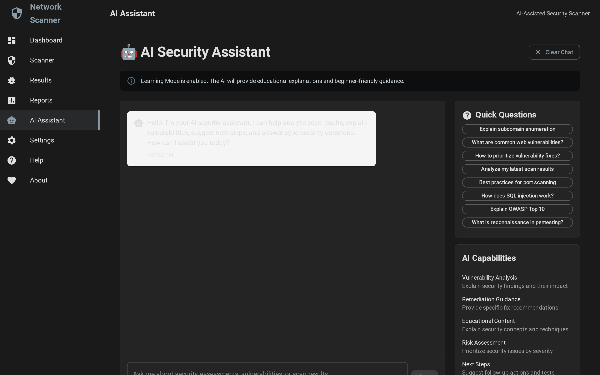
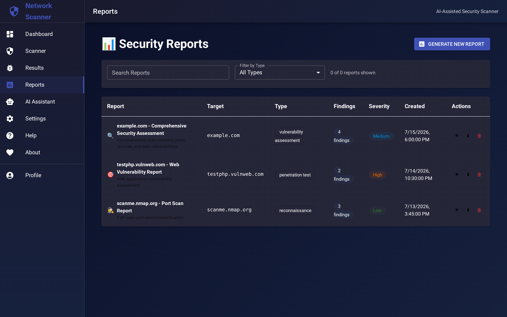
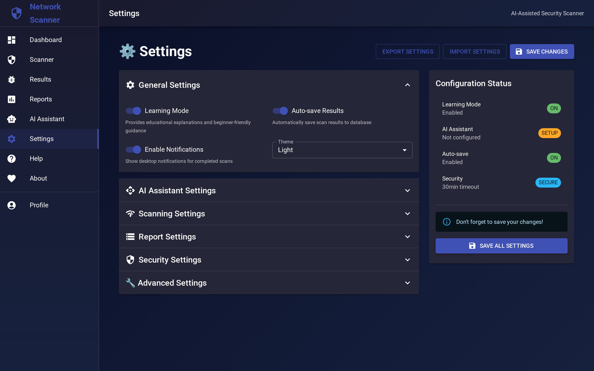
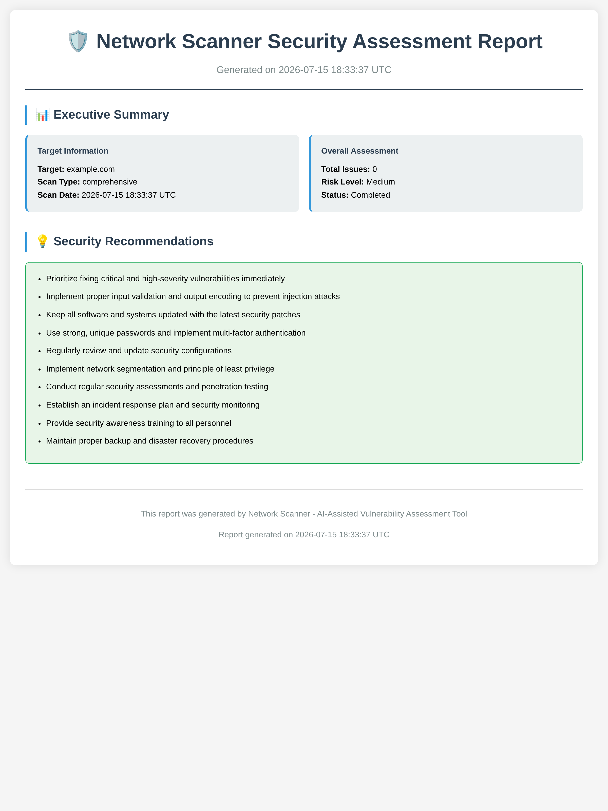

# Network Scanner

**AI-assisted network reconnaissance and security assessment toolkit**

Network Scanner is an open-source toolkit that combines DNS, WHOIS, subdomain, port and selected web checks with a CLI, web interface, structured reporting and optional AI-assisted analysis. It is designed for security research, education, laboratories and explicitly authorized assessments. Some checks are heuristic and their results require manual validation; this project is not a replacement for a professional penetration test or a full production security platform.

[](https://www.python.org/downloads/)
[](https://reactjs.org/)
[](LICENSE)
[](https://github.com/frangelbarrera/Network-Scanner/stargazers)
[](https://github.com/frangelbarrera/Network-Scanner/commits)
[](https://github.com/frangelbarrera/Network-Scanner/issues)
[](https://github.com/frangelbarrera/Network-Scanner)
[](https://github.com/frangelbarrera/Network-Scanner/graphs/contributors)
[](https://github.com/frangelbarrera/Network-Scanner)

## Screenshots

### Dashboard


Overview of scan statistics, recent activity, and quick actions. Metric cards summarise data available in the browser UI; project and history state is stored in browser `localStorage`, not in a server-side multi-user store.

### Scanner


Configure and launch scans against a target. Tabs let you switch between subdomain enumeration, port scanning, vulnerability assessment, DNS enumeration, and WHOIS lookup. Learning Mode toggles educational explanations for beginners.

### Scan Results


Browse scan results stored in the browser `localStorage`, with filters by type and severity. The data survives browser restarts but is not a server-side multi-user project store.

### AI Assistant


Chat interface backed by OpenAI. Ask for explanations of vulnerabilities, prioritisation guidance, or remediation steps. Quick Questions provide one-click prompts for common security topics.

### Reports


List of reports tracked in browser `localStorage`. Filter by type, search by target, and download static HTML or PDF reports; server-side project and audit persistence is not provided by the current API.

### Settings


Configure browser-local preferences, report defaults, and the session-only API access token. AI provider credentials are configured server-side by the operator.

### Sample HTML Report


A generated HTML report rendered in the browser. The same content can be exported as PDF for stakeholder distribution.

##  Features

| Category | Features |
|----------|----------|
|  **Reconnaissance** | Subdomain finder, WHOIS lookup, port scanning, DNS enumeration |
|  **AI Assistant** | OpenAI-powered analysis of scan results with fallback mode |
|  **Automation** | Combined scan workflows via WebSocket or web interface; the CLI exposes individual API commands |
|  **Reports** | Generates PDF and HTML reports from scan results |
|  **Learning Mode** | Educational explanations in the web interface |
|  **API** | RESTful API with optional bearer-token protection and rate limits |
|  **Docker** | Containerised deployment via docker-compose |

### Capability status

The project intentionally combines stable workflows with experimental checks. DNS and WHOIS lookups, subdomain reconnaissance, port scanning, report generation and the CLI are implemented workflows. Vulnerability checks and AI-assisted interpretation are assessment aids: they may use heuristics, depend on local tools and require independent validation. Data models for future project, user and audit workflows are present in the codebase, but they should not be interpreted as a complete multi-user platform.

Scan only systems you own or have explicit permission to assess. Use production configuration, non-default secrets and a protected reverse proxy when hosting the service beyond a local laboratory.

##  Quick Start

### Prerequisites

- Python 3.9+ and pip
- Node.js 16+ and npm
- nmap, dnsutils and whois (installed by `scripts/install.sh` on Ubuntu/Debian; the manual path requires installing them separately with the system package manager). Port and vulnerability scans use Nmap SYN/OS detection and may require root or `CAP_NET_RAW`; the Compose backend grants `NET_RAW`.

### Installation

```bash
# Clone the repository
git clone https://github.com/frangelbarrera/Network-Scanner.git
cd Network-Scanner

# Run the installation script (Ubuntu/Debian)
chmod +x scripts/install.sh
./scripts/install.sh

# Or install manually:
# Backend setup
cd backend
python3 -m venv venv
source venv/bin/activate
pip install -r requirements.txt

# Frontend setup
cd ../frontend
npm install

# CLI setup
cd ../cli
pip3 install -r requirements.txt
chmod +x network_scanner_cli.py
```

### Configuration

```bash
# Copy and edit the environment file. Never commit .env.
cp .env.example .env
# Generate independent production values with: openssl rand -hex 32
# Set SECRET_KEY, API_ACCESS_TOKEN, REDIS_PASSWORD, and (if enabled) POSTGRES_PASSWORD.
```

### Running Network Scanner

**Start the Backend API:**
```bash
cd backend
source venv/bin/activate
python app.py
# API available at http://localhost:5000/api
# An API token is required whenever `API_ACCESS_TOKEN` is configured; production configuration requires it.
```

**Start the Frontend (new terminal):**
```bash
cd frontend
npm start
# Web interface at http://localhost:3000
```

**Use the CLI:**
```bash
# Add to PATH or use directly
python cli/network_scanner_cli.py --help

# Example scans
python cli/network_scanner_cli.py subdomain example.com
python cli/network_scanner_cli.py port 192.168.1.1 --port-range 1-1000
python cli/network_scanner_cli.py vuln https://example.com --scan-type web
# For protected deployments, set NETWORK_SCANNER_API_TOKEN or pass --api-token before the subcommand.
```

### Docker Compose Deployment

Docker Compose exposes only the Nginx proxy, bound to `127.0.0.1:80`. The backend, frontend, Redis, and optional PostgreSQL service remain on the internal Docker network. Configure `.env` first, then start the stack. With the default relative SQLite URL, Flask-SQLAlchemy creates the database under the Flask instance directory (`/app/instance/network_scanner.db` in the container); the published `/app/data` volume does not make that default database durable across container recreation.

```bash
docker compose up --build -d
# Optional PostgreSQL service (the current backend remains configured for SQLite by default):
docker compose --profile postgres up --build -d
```

Deploy TLS at a managed load balancer or reverse proxy that terminates HTTPS and forwards only to `127.0.0.1:80`. The bundled Nginx configuration intentionally does not provide TLS on port 443; place it behind a managed TLS terminator or another trusted reverse proxy, and do not publish its HTTP listener directly to the Internet. In production, enter the value of `API_ACCESS_TOKEN` in **Settings → Service Access** for each browser session, or use `NETWORK_SCANNER_API_TOKEN` with the CLI.

##  Usage Examples

### Web Interface

1. **Dashboard**: View scan statistics, browser-stored results, and quick actions
2. **Scanner**: Configure and run different types of security scans
3. **Results**: Analyze findings with optional AI-assisted insights
4. **Reports**: Generate structured static HTML or PDF reports
5. **AI Assistant**: Chat with AI for security advice and explanations

### Command Line Interface

```bash
# Subdomain enumeration
python cli/network_scanner_cli.py --api-token "$NETWORK_SCANNER_API_TOKEN" subdomain target.com --output results.json

# Port scan with custom range
python cli/network_scanner_cli.py --api-token "$NETWORK_SCANNER_API_TOKEN" port 10.0.0.1 --port-range 1-65535

# Web application vulnerability assessment
python cli/network_scanner_cli.py --api-token "$NETWORK_SCANNER_API_TOKEN" vuln https://target.com --scan-type comprehensive

# DNS reconnaissance
python cli/network_scanner_cli.py --api-token "$NETWORK_SCANNER_API_TOKEN" dns target.com

# Generate a structured report
python cli/network_scanner_cli.py --api-token "$NETWORK_SCANNER_API_TOKEN" report results.json --format pdf
```

### API Usage

```python
import requests

# Start a subdomain scan
headers = {'Authorization': 'Bearer <API_ACCESS_TOKEN>'}
response = requests.post('http://localhost:5000/api/scan/subdomain',
                        headers=headers,
                        json={'domain': 'example.com'})
result = response.json()

# Get AI analysis
ai_response = requests.post('http://localhost:5000/api/ai/chat',
                           headers=headers,
                           json={'message': 'Explain this vulnerability',
                                'context': result})
```

##  Architecture

Network Scanner follows a modular architecture:

```
Network-Scanner/
├── backend/          # Python Flask API server
│   ├── app.py       # Main application
│   ├── modules/     # Scanning and AI modules
│   └── models/      # Database models
├── frontend/         # React web interface
│   ├── src/
│   └── components/
├── cli/             # Command-line interface
├── reports/         # Generated reports
├── docs/           # Documentation
└── scripts/        # Installation and utility scripts
```

### Key Components

- **Reconnaissance Module**: Subdomain enumeration, port scanning, DNS/WHOIS lookups
- **AI Assistant**: Optional OpenAI integration for assisted analysis and recommendations; when configured, submitted messages, context and scan results are sent to the selected provider
- **Vulnerability Scanner**: Web app and network service security assessment using checks that may be heuristic and require manual validation
- **Report Generator**: Professional PDF/HTML report creation
- **Access Control**: Token-gated production API and browser-local project preferences

##  Scan Types

### 1. Subdomain Enumeration
- Brute force common subdomains
- Certificate Transparency log search
- DNS zone transfer attempts
- AI analysis of discovered subdomains

### 2. Port Scanning
- TCP/UDP port discovery
- Service version detection
- Operating system fingerprinting
- Risk assessment of open services

### 3. Vulnerability Assessment
- Web application security testing
- Network service vulnerability detection
- SSL/TLS configuration analysis
- Security header verification

### 4. DNS Enumeration
- A, AAAA, MX, NS, TXT record collection
- DNS zone information gathering
- Email server discovery
- Infrastructure mapping

### 5. WHOIS Lookup
- Domain registration information
- Ownership and contact details
- Name server identification
- Expiration date monitoring

## AI Features

Network Scanner integrates AI to enhance security assessments:

- **Intelligent Analysis**: Assists with interpreting scan results
- **Risk Assessment**: Helps prioritize findings by severity and impact
- **Remediation Guidance**: Suggests fix recommendations for operator review
- **Provider privacy**: When `OPENAI_API_KEY` is configured, messages, supplied context and scan results are transmitted to OpenAI; do not submit personal, confidential or third-party data without appropriate authority and policy review. Untrusted context can influence the prompt, so AI output is advisory and must not be treated as a verified security decision.
- **Learning Mode**: Explains techniques for educational purposes
- **Contextual Chat**: Interactive AI assistant for security questions

##  Reporting

Generate structured security reports in multiple formats:

- **HTML Reports**: Static HTML reports with styled tables and summary cards
- **PDF Reports**: Professional documents for stakeholders
- **JSON Scan Results**: CLI output can be saved as machine-readable data for integration
- **Executive Summaries**: High-level findings for management when included in the scan data

##  Security Considerations

**Important**: Network Scanner is designed for authorized security testing only.

- Only scan systems you own or have explicit permission to test
- Some scans may be detected by security systems
- Selected web checks currently allow self-signed certificates with disabled TLS certificate verification; this can permit man-in-the-middle interference with scanner traffic and must not be used where certificate validation is required
- Follow responsible disclosure practices
- Respect rate limits and target system resources
- Review local laws and regulations before testing

##  Contributing

Contributions and focused improvements are welcome through the repository workflow.

### Development Setup

```bash
# Clone and setup development environment
git clone https://github.com/frangelbarrera/Network-Scanner.git
cd Network-Scanner

# Install dependencies
pip install -r backend/requirements.txt
pip install -r cli/requirements.txt
cd frontend && npm install && cd ..

# Run the regression tests
cd backend
pytest -q
python -m unittest ../cli/test_network_scanner_cli.py -v
```

##  Support

-  **Documentation**: [Wiki](https://github.com/frangelbarrera/Network-Scanner/wiki)
-  **Bug Reports**: [Issues](https://github.com/frangelbarrera/Network-Scanner/issues)
-  **Discussions**: [GitHub Discussions](https://github.com/frangelbarrera/Network-Scanner/discussions)

##  Acknowledgments

- Built with Flask, React, and modern web technologies
- Integrates nmap, dnspython, and other security tools
- UI components from Material-UI
- Charts powered by Recharts
- AI capabilities via OpenAI API

##  Disclaimer

Network Scanner is for educational and authorized testing purposes only. Users are responsible for complying with applicable laws and obtaining proper authorization before scanning any systems. The developers assume no liability for misuse of this tool.

---

**Built for the cybersecurity community**
